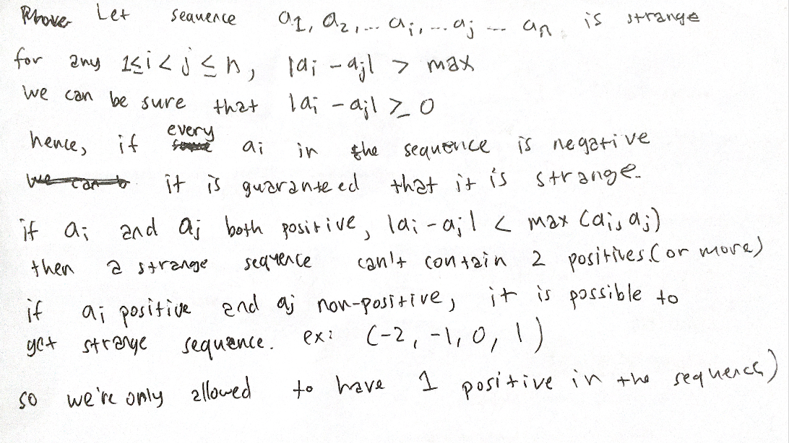

A sequence is considered as "strange" only if we have no more than 1 positive integer (1).  
 
Hence, the maximum length of the sequence is the number of non-positive number in the sequence added by 1, which is the positive integer, if and only if it exists and it is not greater than any |ai-aj| of the non-positive sequence chosen. Here is a proof on statement (1).

